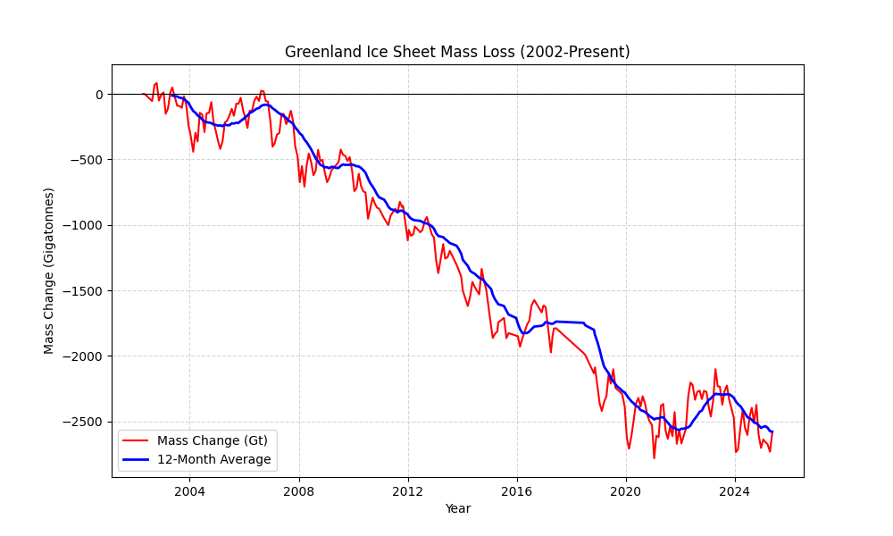

# Greenland Ice Sheet Mass Loss Analysis (2002 - 2025)


## Project Overview
This project visualizes the alarming rate of ice mass loss in Greenland using historical satellite data from **NASA's GRACE (Gravity Recovery and Climate Experiment)** missions. 

By engineering a full-stack data pipeline, this project extracts raw unstructured scientific text, transforms it into a structured format using Python, loads it into a **MySQL** database, and visualizes the accelerating melt trends.

### Objectives
* **Extract:** Ingest raw climate data from NASA archives.
* **Transform:** Convert scientific "decimal dates" (e.g., 2002.29) into standard DateTime objects.
* **Load:** Design a relational database schema for time-series storage.
* **Visualize:** Generate trend lines and rolling averages to identify significant melt events (e.g., the 2012 heatwave).

---

## Architecture & Tech Stack

**Workflow:** `Raw Data (.txt)` ➔ `Python (Pandas Cleaning)` ➔ `MySQL Database` ➔ `Python (Matplotlib Visualization)`

* **Language:** Python 3.x (Pandas, Matplotlib, MySQL-Connector)
* **Database:** MySQL 8.0
* **IDE:** Visual Studio Code

---

## Key Findings

### Mass Change Trend (2002–2024)
*The graph below displays the cumulative mass change (in Gigatonnes) relative to the 2002 baseline.*



**Analysis:**
1.  **Consistent Decline:** The data indicates a persistent negative trend, with an average loss of approximately **270 Gigatonnes per year**.
2.  **Seasonal Volatility:** The red line demonstrates natural seasonal fluctuations (winter snow accumulation vs. summer melting).
3.  **2012 Extreme Melt Event:** A sharp deviation occurred in the summer of 2012, correlating with record-breaking atmospheric high-pressure systems over the Arctic.

---

## Database Schema

The data is stored in a normalized MySQL table designed for efficient time-series querying.

```sql
CREATE TABLE greenland_mass (
    record_date DATE PRIMARY KEY,
    mass_change DECIMAL(10, 2),    -- Mass change in Gigatonnes (Gt)
    uncertainty DECIMAL(10, 2)     -- Measurement uncertainty margin
);
    How to Run This Project
1. Prerequisites
Ensure you have the following installed:

Python 3.x

MySQL Server (running locally)

VS Code (recommended)

2. Clone the Repository
Open your terminal and run:

Bash
git clone https://github.com/michael-anthony-dev/greenland-ice-melt-analysis.git
cd greenland-ice-melt-analysis

## 3. Install Dependencies
Install the required Python libraries using pip:

Bash
pip install -r requirements.txt

##4. Database Setup
Open MySQL Workbench.

Create a new database named climate_db.

Update the password in scripts/visualize.py to match your local MySQL password.

5. Run the Pipeline
Step A: Process the Data Run the cleaning script to convert the raw NASA text file into a format MySQL can accept:

Bash
python scripts/clean_data.py
Step B: Generate the Graph Run the visualization script to fetch data from the database and generate the trend line:

Bash
python scripts/visualize.py
The output image will be saved to the images/ folder.

    Credits & Citations
Data Source: NASA Vital Signs of the Planet / GRACE Tellus mission.

Dataset Citation: Wiese, D. N., D.-N. Yuan, C. Boening, F. W. Landerer, and M. M. Watkins (2019). JPL GRACE and GRACE-FO Mascon Ocean, Ice, and Hydrology Equivalent Water Height RL06M CRI Filtered Version 2.0. Ver. 2.0. PO.DAAC, CA, USA. Dataset accessed at http://dx.doi.org/10.5067/TEMSC-3MJ62.

Methodology Reference: Watkins, M. M., D. N. Wiese, D.-N. Yuan, C. Boening, and F. W. Landerer (2015). Improved methods for observing Earth's time variable mass distribution with GRACE using spherical cap mascons. J. Geophys. Res. Solid Earth, 120. doi:10.1002/2014JB011547.

Acknowledgment: This project was built using data provided by the NASA JPL PO.DAAC and the GRACE/GRACE-FO science team.

    Author
Michael Anthony

Role: Computer Science Student

Contact: michael.anthony170@gmail.com

LinkedIn: https://www.linkedin.com/in/michael-anthony-25b950106/

GitHub: https://github.com/michael-anthony-dev

Feel free to star this repository if you found it helpful!